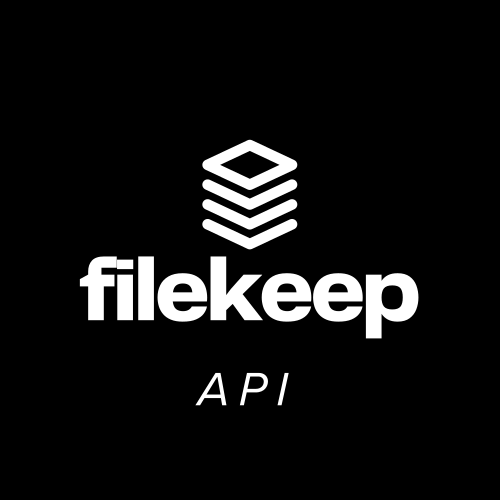

# 📁 FileKeep API — A Dropbox Clone



FileKeep API is the backend solution to the [John Cricket Coding Challenge: Build Your Own Dropbox](https://codingchallenges.fyi/challenges/challenge-dropbox). This backend is responsible for handling file and folder operations, syncing, user data, and interacting with cloud storage. It is built using **Spring Boot**, **PostgreSQL**, and **Docker** for containerized development and deployment.

---

## ⚙️ Tech Stack

- **Language**: Java
- **Framework**: Spring Boot
- **Database**: PostgreSQL
- **Storage**: AWS S3
- **Containerization**: Docker
- **Build Tool**: Gradle

## 🚀 Features

- 📁 File & folder creation, updates, and deletion
- ☁️ Upload/download integration with S3
- 🔗 Shareable links for files and folders
- 🔄 API for syncing local folder structure
- 🧾 Metadata management
- 🔐 User authentication
- 📦 RESTful API design

## 🐳 Getting Started (with Docker)

### 🧰 Prerequisites

Before you begin, make sure you have the following installed and configured:

- [Docker](https://www.docker.com/)
- An **AWS account** with:
  - An **S3 bucket** created for storing files (e.g., `filekeep-bucket`)
  - **Access key** and **secret key** for a user with S3 permissions

### Clone the Repository

```bash
git git@github.com:jayastronomic/filekeep-api.git
cd filekeep-api
```

### Add a .env file to the repo with the following environment variables:

```
# Server Port
PORT=8080

# PostgreSQL Configuration
SPRING_DATASOURCE_URL=jdbc:postgresql://db:5432/filekeep
SPRING_DATASOURCE_USERNAME=postgres
SPRING_DATASOURCE_PASSWORD=password
SPRING_JPA_HIBERNATE_DDL_AUTO=none
SPRING_PROFILES_ACTIVE=dev

# AWS S3 Configuration
S3_BUCKET_NAME=your-s3-bucket-name            # Replace with your actual S3 bucket
S3_ACCESS_KEY=your-s3-access-key              # AWS access key with S3 permissions
S3_SECRET_KEY=your-s3-secret-key              # AWS secret access key

# PostgreSQL Container Config
POSTGRES_USER=postgres
POSTGRES_PASSWORD=password
POSTGRES_DB=filekeep

# JWT Configuration
JWT_SECRET=your-jwt-secret                    # Secret for signing JWT tokens
JWT_EXPIRATION=86400000                       # Token expiration in milliseconds (e.g., 1 day)

# CORS Settings
ALLOWED_ORIGINS=http://localhost:5173,http://localhost:9292  # Add frontend and sync service domains

# Frontend Base URL
BASE_URL=http://localhost:5173

# Sync Client API (Ruby) URL
SYNC_API_URL=http://your-ip-address:9292           # Replace with the IP of your sync client if needed
```

### Build the image & Start the container

```bash
docker-compose up --build
```

## 📮 API Endpoints

### 🔐 AuthController (`/api/v1/auth`)

| Method | Endpoint     | Description                    |
| ------ | ------------ | ------------------------------ |
| POST   | `/register`  | Register a new user            |
| POST   | `/login`     | Log in and receive a token     |
| GET    | `/logged_in` | Check if user is authenticated |

---

### 🗄️ FileController (`/api/v1/files`)

| Method | Endpoint     | Description                    |
| ------ | ------------ | ------------------------------ |
| POST   | `/upload`    | Upload a file to a folder      |
| GET    | `/{fileKey}` | Download a file by key         |
| DELETE | `/{fileKey}` | Delete a file                  |
| POST   | `/share`     | Share a file with another user |

---

### 🗂 FolderController (`/api/v1/folders`)

| Method | Endpoint      | Description                      |
| ------ | ------------- | -------------------------------- |
| GET    | `/home`       | Get the user's home folder       |
| GET    | `/{folderId}` | Fetch a folder by ID             |
| POST   | `/`           | Create a new folder              |
| DELETE | `/{folderId}` | Delete a folder by ID            |
| POST   | `/share`      | Share a folder with another user |

---

### 🔗 ShareableLinkController (`/api/v1/shareable_links`)

| Method | Endpoint                | Description                           |
| ------ | ----------------------- | ------------------------------------- |
| POST   | `/`                     | Create a new shareable link           |
| GET    | `/file?token={token}`   | Access a file via shareable link      |
| PUT    | `/file?token={token}`   | Update shared file access using token |
| GET    | `/folder?token={token}` | Access a folder via shareable link    |

---

### 🤝 SharedAccessController (`/api/v1/shared`)

| Method | Endpoint | Description                          |
| ------ | -------- | ------------------------------------ |
| GET    | `/`      | List all assets shared with the user |

---

### 🔄 SyncController (`/api/v1/sync`)

| Method | Endpoint | Description                                           |
| ------ | -------- | ----------------------------------------------------- |
| POST   | `/`      | Sync local changes (upload files/folders from client) |
| GET    | `/`      | Download current synced files as zip                  |

## 📚 Challenge Context

This backend supports the FileKeep frontend built for the Build Your Own Dropbox Challenge by John Cricket.

> Building a simplified version of Dropbox that supports file uploads, downloads, folder management, and link sharing — optionally including syncing capabilities with a local folder.

## 🤝 Contributing

Pull requests are welcome! For major changes, please open an issue first to discuss what you’d like to change.

## 📄 License

This project is open-source and available under the [MIT License](LICENSE).
